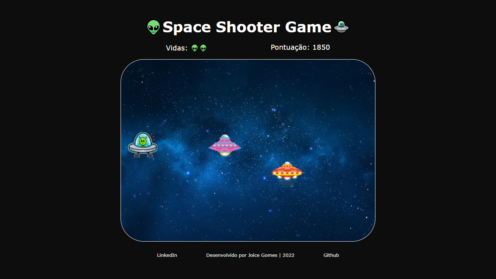
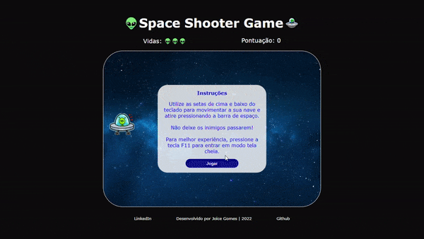

# Space Shooter Game | Desafio Criando seu jogo no estilo Space Shooter

Projeto desenvolvido para o desafio Criando seu jogo no estilo Space Shooter, utilizando HTML, CSS e JavaScript.  

Para a lógica do jogo utilizei manipulação do DOM e de Arrays, condicionais e eventListeners.

O jogo pode ser acessado a partir de um navegador de internet em um computador.   

### Instruções

- Utilize as setas de cima e baixo do teclado para movimentar a sua nave e atire pressionando a barra de espaço.  
- O objetivo é não deixar os inimigos passarem.
- Para melhor experiência, pressione a tecla F11 para entrar em modo tela cheia.

## Acesse o jogo clicando [aqui](https://joi-gn.github.io/space_shooter_jogo_desafio_projeto/)

